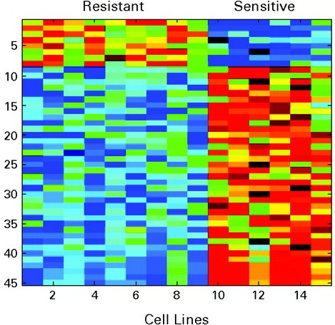

```{r style, echo = FALSE, results = 'asis'}
BiocStyle::markdown()
options(width=100, max.print=1000)
knitr::opts_chunk$set(
    eval=as.logical(Sys.getenv("KNITR_EVAL", "TRUE")),
    cache=as.logical(Sys.getenv("KNITR_CACHE", "TRUE")))
```

```{r packages, eval=TRUE, echo=FALSE, warning=FALSE, message=FALSE}
suppressPackageStartupMessages({
    library(BioC2016Introduction)
    library(SummarizedExperiment)
    library(airway)
})
```

The material in this course requires R version 3.3 and Bioconductor
version 3.4

```{r configure-test}
stopifnot(
    getRversion() >= '3.3' && getRversion() < '3.4',
    BiocInstaller::biocVersion() == "3.4"
)
```

Version: `r packageDescription("BioC2016Introduction")$Version`<br />
Compiled: `r date()`

# _Bioconductor_

Physically

- Collection of 1211 software, 916 annotation and 293 experimental
  data R packages.
- Web site (http://bioconductor.org) for package distribution and
  other resources.
- Support site (https://support.bioconductor.org) for user questions.

Conceptually

- Analysis and comprehension of high throughput genomic data

# Core principles

## High-throughput analysis needs statistics!

Volume of data

Type of research question

- Designed experiments
- Population samples
- ...

Technological artifacts

- Differences in sequencing depth between samples
- Bias in the genomic regions sampled

## Scientific research needs to be reproducible

### A motivating case study

- Cisplatin-resistant non-small-cell lung cancer gene sets

- Hsu et al. 2007 J Clin Oncol 25:
  [4350-4357](http://jco.ascopubs.org/content/25/28/4350.abstract)
  [retracted](http://jco.ascopubs.org/content/28/35/5229.long)

  

- Baggerly & Coombes 2009 Ann Appl Stat
  [3: 1309-1334](http://projecteuclid.org/DPubS?service=UI&version=1.0&verb=Display&handle=euclid.aoas/1267453942)

  

Lessons

- Record each step of the analysis
- Coordinated manipulation of feature, sample, and assay data
- Informative labels on visualizations

### How to be reproducible?

- Use software 'objects' that take care of some of the tedious
  book-keeping
- Document our analysis in scripts and 'markdown' documents

### Example: `SummarizedExperiment`


Underlying data is a matrix

- Regions of interest (e.g., genes) x samples
- `assay()` -- e.g., matrix of counts of reads overlapping genes

Include information about rows

- `rowRanges()` -- gene identifiers, or _genomic ranges_ describing
  the coordinates of each gene

Include information about columns

- `colData()` -- describing samples, experimental design, ...

```{r airway-SummarizedExperiment}
library(airway)         # An 'ExperimentData' package...
data(airway)            # ...with a sample data set...
airway                  # ...that is a SummarizedExperiment
head(assay(airway))     # contains a matrix of counts
head(rowRanges(airway)) # information about the genes...
colData(airway)[, 1:3]  # ...and samples
## coordinated subsetting
untrt <- airway[, airway$dex == 'untrt']
head(assay(untrt))
colData(untrt)[, 1:3]
```

## We can 'stand on the shoulders of giants'

Packages!

- Discover and navigate via [biocViews][]
- Package 'landing page'
  - Title, author / maintainer, short description, citation,
    installation instructions, ..., download statistics
- All user-visible functions have help pages, most with runnable
  examples
- 'Vignettes' an important feature in Bioconductor -- narrative
  documents illustrating how to use the package, with integrated code
- 'Workflows' make use of multiple packages for complete end-to-end
  analysis
- 'Release' (every six months) and 'devel' branches
- [Support site](https://support.bioconductor.org);
  [videos](https://www.youtube.com/user/bioconductor), [recent
  courses](http://bioconductor.org/help/course-materials/)

## We should explore our data

Visualization

Inter-operability between packages

- Made easier by using similar data structures

Examples (details later)

- `SummarizedExperiment`
- `DNAStringSet`
- `GenomicRanges`

## Comprehension is more than statistical analysis

Annotation

- Mapping from technical to user-friendly identifiers
- Assigning genes to pathways
- Placing our results in the context of large-scale analyses

Objects

- Represent complicated data types
- Foster interoperability
- S4 object system
  - Introspection: `methods()`, `getClass()`, `selectMethod()`
  - 'accessors' and other documented functions / methods for
    manipulation, rather than direct access to the object structure
- Interactive help
  - `method?"substr,<tab>"` to select help on methods, `class?D<tab>`
    for help on classes

## A sequence analysis package tour


This very open-ended topic points to some of the most prominent
Bioconductor packages for sequence analysis. Use the opportunity in
this lab to explore the package vignettes and help pages highlighted
below; many of the material will be covered in greater detail in
subsequent labs and lectures.

Basics 

- Bioconductor packages are listed on the [biocViews][] page. Each
  package has 'biocViews' (tags from a controlled vocabulary)
  associated with it; these can be searched to identify appropriately
  tagged packages, as can the package title and author.
- Each package has a 'landing page', e.g., for
  [GenomicRanges][]. Visit this landing page, and note the
  description, authors, and installation instructions. Packages are
  often written up in the scientific literature, and if available the
  corresponding citation is present on the landing page. Also on the
  landing page are links to the vignettes and reference manual and, at
  the bottom, an indication of cross-platform availability and
  download statistics.
-   A package needs to be installed once, using the instructions on the
    landing page. Once installed, the package can be loaded into an R
    session

    ```{r require}
    library(GenomicRanges)
    ```
    
    and the help system queried interactively, as outlined above:

    ```{r help, eval=FALSE}
      help(package="GenomicRanges")
      vignette(package="GenomicRanges")
      vignette(package="GenomicRanges", "GenomicRangesHOWTOs")
      ?GRanges
    ```
    
Domain-specific analysis -- explore the landing pages, vignettes, and
reference manuals of two or three of the following packages.

- Important packages for analysis of differential expression include
  [edgeR][] and [DESeq2][]; both have excellent vignettes for
  exploration. Additional research methods embodied in Bioconductor
  packages can be discovered by visiting the [biocViews][] web page,
  searching for the 'DifferentialExpression' view term, and narrowing
  the selection by searching for 'RNA seq' and similar.
- Popular ChIP-seq packages include [csaw][] an d[DiffBind][] for
  comparison of peaks across samples, [ChIPQC][] for quality
  assessment, and [ChIPseeker][] for annotating results (e.g.,
  discovering nearby genes). What other ChIP-seq packages are listed
  on the [biocViews][] page?
- Working with called variants (VCF files) is facilitated by packages
  such as [VariantAnnotation][], [VariantFiltering][], [ensemblVEP][],
  and [SomaticSignatures][]; packages for calling variants include,
  e.g., [h5vc][] and [VariantTools][].
- Several packages identify copy number variants from sequence data,
  including [cn.mops][]; from the [biocViews][] page, what other copy
  number packages are available? The [CNTools][] package provides some
  useful facilities for comparison of segments across samples.
- Microbiome and metagenomic analysis is facilitated by packages such
  as [phyloseq][] and [metagenomeSeq][].
- Metabolomics, chemoinformatics, image analysis, and many other
  high-throughput analysis domains are also represented in
  Bioconductor; explore these via biocViews and title searches.
  
Working with sequences, alignments, common web file formats, and raw
data; these packages rely very heavily on the [IRanges][] /
[GenomicRanges][] infrastructure that we will encounter later in the
course.

- The [Biostrings][] package is used to represent DNA and other
  sequences, with many convenient sequence-related functions. Check
  out the functions documented on the help page `?consensusMatrix`,
  for instance. Also check out the [BSgenome][] package for working
  with whole genome sequences, e.g., `?"getSeq,BSgenome-method"`
- The [GenomicAlignments][] package is used to input reads aligned to
  a reference genome. See for instance the `?readGAlignments` help
  page and `vigentte(package="GenomicAlignments",
  "summarizeOverlaps")`
- [rtracklayer][]'s `import` and `export` functions can read in many
  common file types, e.g., BED, WIG, GTF, ..., in addition to querying
  and navigating the UCSC genome browser. Check out the `?import` page
  for basic usage.
- The [ShortRead][] and [Rsamtools][] packages can be used for
  lower-level access to FASTQ and BAM files, respectively. Explore the
  [ShortRead vignette](http://bioconductor.org/packages/release/bioc/vignettes/ShortRead/inst/doc/Overview.pdf)
  and Scalable Genomics labs to see approaches to effectively
  processing the large files.

Visualization

- The [Gviz][] package provides great tools for visualizing local
  genomic coordinates and associated data. 
- [epivizr][] drives the [epiviz](http://epiviz.cbcb.umd.edu/) genome
  browser from within R; [rtracklayer][] provides easy ways to
  transfer data to and manipulate UCSC browser sessions.
- Additionl packages include [ggbio][], [OmicCircos][], ...

## DNA or amino acid sequences: _Biostrings_, _ShortRead_, _BSgenome_

Classes

- XString, XStringSet, e.g., DNAString (genomes),
  DNAStringSet (reads)

Methods --

- [Cheat sheat](http://bioconductor.org/packages/release/bioc/vignettes/Biostrings/inst/doc/BiostringsQuickOverview.pdf)
- Manipulation, e.g., `reverseComplement()`
- Summary, e.g., `letterFrequency()`
- Matching, e.g., `matchPDict()`, `matchPWM()`

Related packages

- [BSgenome][]
    - Whole-genome representations
    - Model and custom
- [ShortRead][]
    - FASTQ files

Example 

- Whole-genome sequences are distrubuted by ENSEMBL, NCBI, and others
  as FASTA files; model organism whole genome sequences are packaged
  into more user-friendly `BSgenome` packages. The following
  calculates GC content across chr14.

```{r BSgenome-require, message=FALSE}
  require(BSgenome.Hsapiens.UCSC.hg19)
  chr14_range = GRanges("chr14", IRanges(1, seqlengths(Hsapiens)["chr14"]))
  chr14_dna <- getSeq(Hsapiens, chr14_range)
  letterFrequency(chr14_dna, "GC", as.prob=TRUE)
```
  
## Ranges: _GenomicRanges_, _IRanges_

Ranges represent:
- Data, e.g., aligned reads, ChIP peaks, SNPs, CpG islands, ...
- Annotations, e.g., gene models, regulatory elements, methylated
  regions
- Ranges are defined by chromosome, start, end, and strand
- Often, metadata is associated with each range, e.g., quality of
  alignment, strength of ChIP peak

Many common biological questions are range-based
- What reads overlap genes?
- What genes are ChIP peaks nearest?
- ...


The [GenomicRanges][] package defines essential classes and methods

- `GRanges`


- `GRangesList`


### Range operations


Ranges
- IRanges
  - `start()` / `end()` / `width()`
  - List-like -- `length()`, subset, etc.
  - 'metadata', `mcols()`
- GRanges
  - 'seqnames' (chromosome), 'strand'
  - `Seqinfo`, including `seqlevels` and `seqlengths`

Intra-range methods
- Independent of other ranges in the same object
- GRanges variants strand-aware
- `shift()`, `narrow()`, `flank()`, `promoters()`, `resize()`,
  `restrict()`, `trim()`
- See `?"intra-range-methods"`

Inter-range methods
- Depends on other ranges in the same object
- `range()`, `reduce()`, `gaps()`, `disjoin()`
- `coverage()` (!)
- see `?"inter-range-methods"`

Between-range methods
- Functions of two (or more) range objects
- `findOverlaps()`, `countOverlaps()`, ..., `%over%`, `%within%`,
  `%outside%`; `union()`, `intersect()`, `setdiff()`, `punion()`,
  `pintersect()`, `psetdiff()`

Example

```{r ranges, message=FALSE}
require(GenomicRanges)
gr <- GRanges("A", IRanges(c(10, 20, 22), width=5), "+")
shift(gr, 1)                            # 1-based coordinates!
range(gr)                               # intra-range
reduce(gr)                              # inter-range
coverage(gr)
setdiff(range(gr), gr)                  # 'introns'
```

IRangesList, GRangesList
- List: all elements of the same type
- Many *List-aware methods, but a common 'trick': apply a vectorized
  function to the unlisted representaion, then re-list

        grl <- GRangesList(...)
        orig_gr <- unlist(grl)
        transformed_gr <- FUN(orig)
        transformed_grl <- relist(, grl)
        
Reference

- Lawrence M, Huber W, Pag&egrave;s H, Aboyoun P, Carlson M, et al. (2013)
  Software for Computing and Annotating Genomic Ranges. PLoS Comput
  Biol 9(8): e1003118. doi:10.1371/journal.pcbi.1003118

## Aligned reads: _GenomicAlignments_, _Rsamtools_

Classes -- GenomicRanges-like behaivor

- GAlignments, GAlignmentPairs, GAlignmentsList
- SummarizedExperiment
  - Matrix where rows are indexed by genomic ranges, columns by a
    DataFrame.

Methods

- `readGAlignments()`, `readGAlignmentsList()`
  - Easy to restrict input, iterate in chunks
- `summarizeOverlaps()`

Example

- Find reads supporting the junction identified above, at position
  19653707 + 66M = 19653773 of chromosome 14

```{r bam-require}
require(GenomicRanges)
require(GenomicAlignments)
require(Rsamtools)

## our 'region of interest'
roi <- GRanges("chr14", IRanges(19653773, width=1)) 
## sample data
require('RNAseqData.HNRNPC.bam.chr14')
bf <- BamFile(RNAseqData.HNRNPC.bam.chr14_BAMFILES[[1]], asMates=TRUE)
## alignments, junctions, overlapping our roi
paln <- readGAlignmentsList(bf)
j <- summarizeJunctions(paln, with.revmap=TRUE)
j_overlap <- j[j %over% roi]

## supporting reads
paln[j_overlap$revmap[[1]]]
```
  
## Called variants: _VariantAnnotation_, _VariantFiltering_

Classes -- GenomicRanges-like behavior

- VCF -- 'wide'
- VRanges -- 'tall'

Functions and methods

- I/O and filtering: `readVcf()`, `readGeno()`, `readInfo()`,
  `readGT()`, `writeVcf()`, `filterVcf()`
- Annotation: `locateVariants()` (variants overlapping ranges),
  `predictCoding()`, `summarizeVariants()`
- SNPs: `genotypeToSnpMatrix()`, `snpSummary()`

Example

- Read variants from a VCF file, and annotate with respect to a known
  gene model
  
```{r vcf, message=FALSE}
  ## input variants
  require(VariantAnnotation)
  fl <- system.file("extdata", "chr22.vcf.gz", package="VariantAnnotation")
  vcf <- readVcf(fl, "hg19")
  seqlevels(vcf) <- "chr22"
  ## known gene model
  require(TxDb.Hsapiens.UCSC.hg19.knownGene)
  coding <- locateVariants(rowRanges(vcf),
      TxDb.Hsapiens.UCSC.hg19.knownGene,
      CodingVariants())
  head(coding)
```

Related packages

- [ensemblVEP][] 
    - Forward variants to Ensembl Variant Effect Predictor
- [VariantTools][], [h5vc][]
    - Call variants
- [VariantFiltering][]
    - Filter variants using criteria such as coding consequence, MAF,
       ..., inheritance model

Reference

- Obenchain, V, Lawrence, M, Carey, V, Gogarten, S, Shannon, P, and
  Morgan, M. VariantAnnotation: a Bioconductor package for exploration
  and annotation of genetic variants. Bioinformatics, first published
  online March 28, 2014
  [doi:10.1093/bioinformatics/btu168](http://bioinformatics.oxfordjournals.org/content/early/2014/04/21/bioinformatics.btu168)

## Integrated data representations: _SummarizedExperiment_


[SummarizedExperiment][]

- 'feature' x 'sample' `assays()`
- `colData()` data frame for desciption of samples
- `rowRanges()` _GRanges_ / _GRangeList_ or data frame for description
  of features
- `exptData()` to describe the entire object

    ```{r SummarizedExperiment}
    library(SummarizedExperiment)
    library(airway)
    data(airway)
    airway
    colData(airway)
    airway[, airway$dex %in% "trt"]
    ```
    
## Annotation: _org_, _TxDb_, _AnnotationHub_, _biomaRt_, ...

- _Bioconductor_ provides extensive access to 'annotation' resources
  (see the [AnnotationData][] biocViews hierarchy); some interesting
  examples to explore during this lab include:
- [biomaRt][], [PSICQUIC][], [KEGGREST][] and other packages for
  querying on-line resources; each of these have informative vignettes.
- [AnnotationDbi][] is a cornerstone of the
  [Annotation Data][AnnotationData] packages provided by Bioconductor.
    - **org** packages (e.g., [org.Hs.eg.db][]) contain maps between
      different gene identifiers, e.g., ENTREZ and SYMBOL. The basic
      interface to these packages is described on the help page `?select`
    - **TxDb** packages (e.g., [TxDb.Hsapiens.UCSC.hg19.knownGene][])
      contain gene models (exon coordinates, exon / transcript
      relationships, etc) derived from common sources such as the hg19
      knownGene track of the UCSC genome browser. These packages can be
      queried, e.g., as described on the `?exonsBy` page to retrieve all
      exons grouped by gene or transcript.
    - **BSgenome** packages (e.g., [BSgenome.Hsapiens.UCSC.hg19][])
      contain whole genomes of model organisms.
- [VariantAnnotation][] and [ensemblVEP][] provide access to sequence
  annotation facilities, e.g., to identify coding variants; see the
  [Introduction to VariantAnnotation](http://bioconductor.org/packages/release/bioc/vignettes/ShortRead/inst/doc/Overview.pdf)
  vignette for a brief introduction.
- Take a quick look at the [annotation work
  flow](http://bioconductor.org/help/workflows/annotation/annotation/)
  on the Bioconductor web site.


## Scalable computing

1. Efficient _R_ code
   - Vectorize!
   - Reuse others' work Know -- [DESeq2][], [GenomicRanges][],
     [Biostrings][], [dplyr][], [data.table][], [Rcpp][]
2. Iteration
   - Chunk-wise
   - `open()`, read chunk(s), `close()`.
   - e.g., `yieldSize` argument to `Rsamtools::BamFile()`
3. Restriction
   - Limit to columns and / or rows of interest
   - Exploit domain-specific formats, e.g., BAM files and
     `Rsamtools::ScanBamParam()`
   - Use a data base
4. Sampling
   - Iterate through large data, retaining a manageable sample, e.g.,
     `ShortRead::FastqSampler()`
5. Parallel evaluation
   - **After** writing efficient code
   - Typically, `lapply()`-like operations
   - Cores on a single machine ('easy'); clusters (more tedious);
     clouds

Parallel evaluation in _Bioconductor_

- [BiocParallel][] -- `bplapply()` for `lapply()`-like functions,
  increasingly used by package developers to provide easy, standard
  way of gaining parallel evaluation.
- [GenomicFiles][] -- Framework for working on groups of files,
  ranges, or ranges x files
- Bioconductor [AMI][] (Amazon Machine Instance) including
  pre-configured StarCluster, and [docker] containers.

# Resources

_R_ / _Bioconductor_

- [Web site][Bioconductor] -- install, learn, use, develop _R_ /
  _Bioconductor_ packages
- [Support](http://support.bioconductor.org) -- seek help and
  guidance; also
  [StackOverflow](http://stackoverflow.com/questions/tagged/r) for _R_
  programming questions
- [biocViews](http://bioconductor.org/packages/release/BiocViews.html)
  -- discover packages
- Package landing pages, e.g.,
  [GenomicRanges](http://bioconductor.org/packages/release/bioc/html/GenomicRanges.html),
  including title, description, authors, installation instructions,
  vignettes (e.g., GenomicRanges '[How
  To](http://bioconductor.org/packages/release/bioc/vignettes/GenomicRanges/inst/doc/GenomicRangesHOWTOs.pdf)'),
  etc.
- [Course](http://bioconductor.org/help/course-materials/) and other
  [help](http://bioconductor.org/help/) material (e.g., videos, EdX
  course, community blogs, ...)

Publications (General _Bioconductor_)

- Lawrence M, Huber W, Pag&egrave;s H, Aboyoun P, Carlson M, et al. (2013)
  Software for Computing and Annotating Genomic Ranges. PLoS Comput
  Biol 9(8): e1003118. doi:
  [10.1371/journal.pcbi.1003118][GRanges.bib]
- Lawrence, M, and Morgan, M. 2014. Scalable Genomics with R and
  Bioconductor. Statistical Science 2014, Vol. 29, No. 2,
  214-226. [http://arxiv.org/abs/1409.2864v1][Scalable.bib]

Other

- Lawrence, M. 2014. Software for Enabling Genomic Data
  Analysis. Bioc2014 conference [slides][Lawrence.bioc2014.bib].

Acknowledgements

  The research reported in this presentation was supported by the
  National Cancer Institute and the National Human Genome Research
  Institute of the National Institutes of Health under Award numbers
  U24CA180996 and U41HG004059, and the National Science Foundation
  under Award number 1247813. The content is solely the responsibility
  of the authors and does not necessarily represent the official views
  of the National Institutes of Health or the National Science
  Foundation.

## `sessionInfo()`

```{r sessionInfo}
sessionInfo()
```

<!-- Bibliography -->

[R]: http://r-project.org
[Bioconductor]: http://bioconductor.org
[GRanges.bib]: http://dx.doi.org/10.1371/journal.pcbi.1003118
[Scalable.bib]: http://arxiv.org/abs/1409.2864
[Lawrence.bioc2014.bib]:
    http://bioconductor.org/help/course-materials/2014/BioC2014/Lawrence_Talk.pdf


[AnnotationData]: http://bioconductor.org/packages/release/BiocViews.html#___AnnotationData
[biocViews]: http://bioconductor.org/packages/release/BiocViews.html#___Software

[AnnotationDbi]: http://bioconductor.org/packages/AnnotationDbi
[AnnotationHub]: http://bioconductor.org/packages/AnnotationHub
[BSgenome.Hsapiens.UCSC.hg19]: http://bioconductor.org/packages/BSgenome.Hsapiens.UCSC.hg19
[BSgenome]: http://bioconductor.org/packages/BSgenome
[BiocParallel]: http://bioconductor.org/packages/BiocParallel
[Biostrings]: http://bioconductor.org/packages/Biostrings
[CNTools]: http://bioconductor.org/packages/CNTools
[ChIPQC]: http://bioconductor.org/packages/ChIPQC
[ChIPseeker]: http://bioconductor.org/packages/ChIPseeker
[DESeq2]: http://bioconductor.org/packages/DESeq2
[DiffBind]: http://bioconductor.org/packages/DiffBind
[GenomicAlignments]: http://bioconductor.org/packages/GenomicAlignments
[GenomicFiles]: http://bioconductor.org/packages/GenomicFiles
[GenomicRanges]: http://bioconductor.org/packages/GenomicRanges
[Homo.sapiens]: http://bioconductor.org/packages/Homo.sapiens
[IRanges]: http://bioconductor.org/packages/IRanges
[KEGGREST]: http://bioconductor.org/packages/KEGGREST
[PSICQUIC]: http://bioconductor.org/packages/PSICQUIC
[Rsamtools]: http://bioconductor.org/packages/Rsamtools
[Rsubread]: http://bioconductor.org/packages/Rsubread
[ShortRead]: http://bioconductor.org/packages/ShortRead
[SomaticSignatures]: http://bioconductor.org/packages/SomaticSignatures
[SummarizedExperiment]: http://bioconductor.org/packages/SummarizedExperiment
[TxDb.Hsapiens.UCSC.hg19.knownGene]: http://bioconductor.org/packages/TxDb.Hsapiens.UCSC.hg19.knownGene
[VariantAnnotation]: http://bioconductor.org/packages/VariantAnnotation
[VariantFiltering]: http://bioconductor.org/packages/VariantFiltering
[VariantTools]: http://bioconductor.org/packages/VariantTools
[biomaRt]: http://bioconductor.org/packages/biomaRt
[cn.mops]: http://bioconductor.org/packages/cn.mops
[csaw]: http://bioconductor.org/packages/csaw
[edgeR]: http://bioconductor.org/packages/edgeR
[ensemblVEP]: http://bioconductor.org/packages/ensemblVEP 
[h5vc]: http://bioconductor.org/packages/h5vc
[limma]: http://bioconductor.org/packages/limma
[metagenomeSeq]: http://bioconductor.org/packages/metagenomeSeq
[org.Hs.eg.db]: http://bioconductor.org/packages/org.Hs.eg.db
[org.Sc.sgd.db]: http://bioconductor.org/packages/org.Sc.sgd.db
[phyloseq]: http://bioconductor.org/packages/phyloseq
[rtracklayer]: http://bioconductor.org/packages/rtracklayer
[snpStats]: http://bioconductor.org/packages/snpStats
[Gviz]: http://bioconductor.org/packages/Gviz
[epivizr]: http://bioconductor.org/packages/epivizr
[ggbio]: http://bioconductor.org/packages/ggbio
[OmicCircos]: http://bioconductor.org/packages/OmicCircos

[dplyr]: https://cran.r-project.org/package=dplyr
[data.table]: https://cran.r-project.org/package=data.table
[Rcpp]: https://cran.r-project.org/package=Rcpp

[AMI]: http://bioconductor.org/help/bioconductor-cloud-ami/
[docker]: http://bioconductor.org/help/docker/
